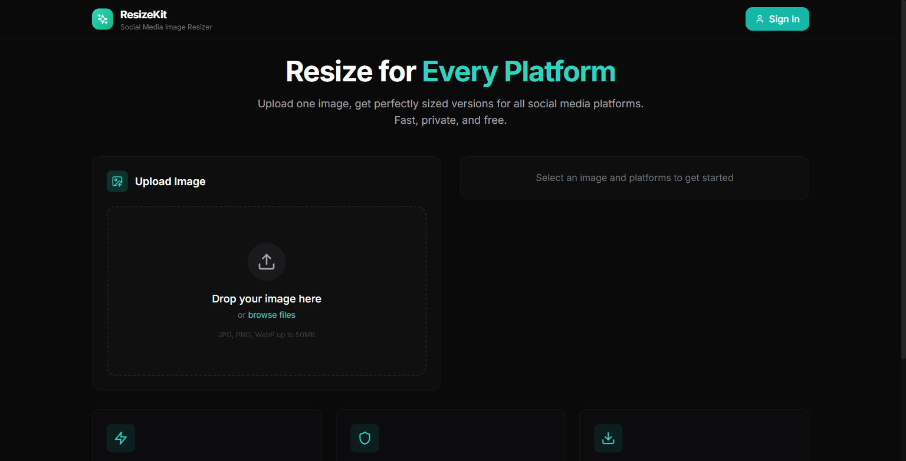

# ResizeKit

Browser tool for resizing images to social-platform presets (Instagram, TikTok, X/Twitter, YouTube, Facebook, LinkedIn) or a custom size.

**Live:** [resize-kit.vercel.app](https://resize-kit.vercel.app/)

## Screenshots

### Home



*Upload one image, pick social platform presets, and download resized versions - all in the browser.*

## Features

- Platform presets + custom dimensions
- Drag and drop upload
- Aspect-ratio lock option
- One-click download
- Dark mode
- ZIP helpers for batch-style export flows (`jszip` / `file-saver`)

## Stack

| Piece | Choice |
|---|---|
| App | Vite + React + TypeScript |
| UI | Tailwind CSS |
| Extras | Lucide icons, optional Supabase client |
| Host | Vercel |

## Run locally

```bash
git clone https://github.com/xusnitdinov/ResizeKit.git
cd ResizeKit
npm install
npm run dev
```

Build:

```bash
npm run build
npm run preview
```

## License

MIT
